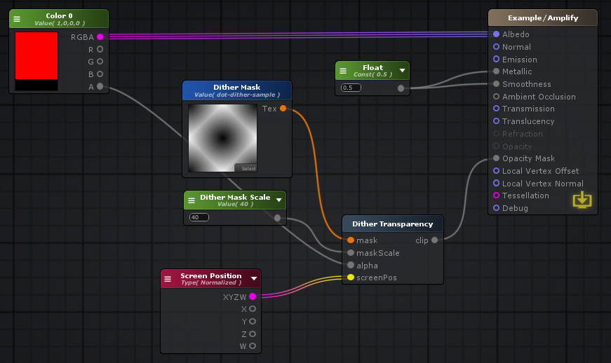

# Use in Amplify Shader Editor

## Shader Node

The dither node is provided as `GarrettJohnson/Dither Transparency`

### Properties
#### Inputs
###### Mask

The pattern in place of dithering to use.

###### MaskScale

The scale of the mask texture if it's provided.

###### Alpha

The alpha to mask as

###### ScreenPos

The position on the screen from [0, 1]

#### Outputs
###### Clip
A value from [0, 1] indicating whether or not to clip
