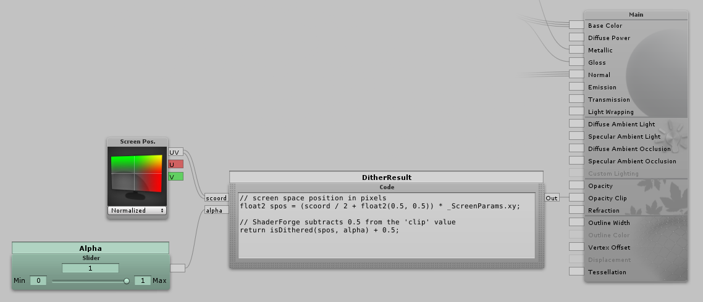

# Use in Shader Forge


## ShaderForge Code Node
### Steps
#### Include the CGINC file
Add the `Dither Functions.cginc` file to the shader in the "Shader Settings" panel

#### Code Node
Add a code node

##### Properties
Add the properties `scoord` as a `float2` and `alpha` as a `float`

##### Code
Set the code body to
```hlsl
// screen space position in pixels
float2 spos = (scoord / 2 + float2(0.5, 0.5)) * _ScreenParams.xy;

// ShaderForge subtracts 0.5 from the 'clip' value
return ceil(isDithered(spos, alpha));
```

#### For Clip Mask


##### Properties
Add `mask` as a `sampler2D` and `maskScale` as `float`

##### Code
Set the code body to
```hlsl
// screen space position in pixels
float2 spos = (scoord / 2 + float2(0.5, 0.5)) * _ScreenParams.xy;

// ShaderForge subtracts 0.5 from the 'clip' value
return ceil(isDithered(spos, alpha, mask, maskScale));
```
